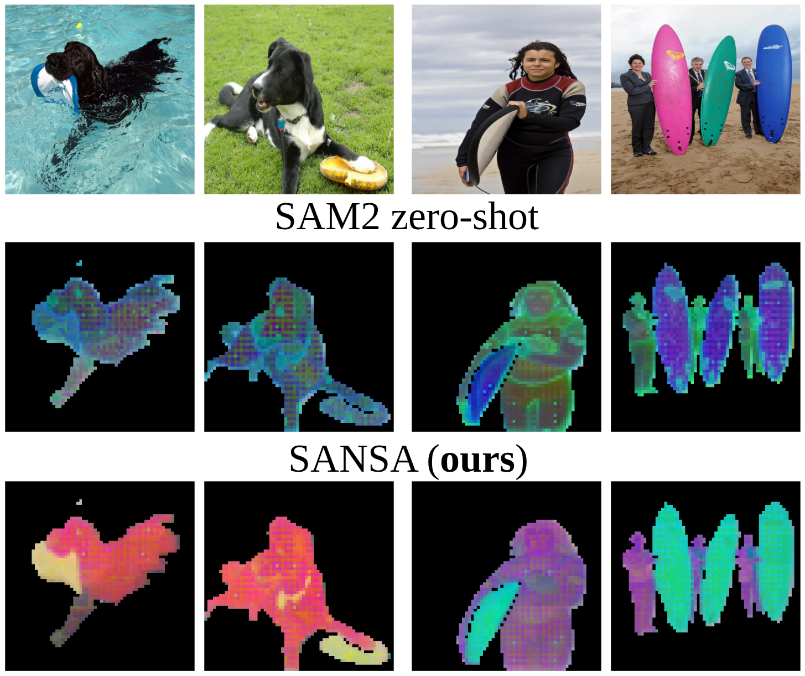

  

# SANSA: Unleashing the Hidden Semantics in SAM2 for Few-Shot Segmentation

📄 **[arXiv Preprint](https://arxiv.org/abs/2505.21795)**  
[Claudia Cuttano](https://scholar.google.it/citations?user=W7lNKNsAAAAJ&hl=en), [Gabriele Trivigno](https://scholar.google.com/citations?user=JXf_iToAAAAJ&hl=en), [Giuseppe Averta](https://scholar.google.it/citations?user=i4rm0tYAAAAJ&hl=en), [Carlo Masone](https://scholar.google.it/citations?user=cM3Iz_4AAAAJ&hl=en)

Welcome to the official repository for **SANSA**, our paper: *"SANSA: Unleashing the Hidden Semantics in SAM2 for Few-Shot Segmentation"*.

https://github.com/user-attachments/assets/013be54f-aaec-4e31-b670-ba053f9f9bb0

**SANSA supports a wide range of prompts** — including **points**, **boxes**, **scribbles**, and **masks**.  
Given one or more reference images, it segments **semantically corresponding objects** in the target image.  
The entire process runs in a **unified pipeline**, with no prompt-specific adjustments or external models.

> 🛠️ **Coming Soon**
> - 🔓 Open-source code and trained models
> - 💻 Try SANSA directly on your own data.

---

## 🌟 Why SANSA?

Beneath SAM2 tracking architecture lies a surprisingly **rich semantic feature space**.
**SANSA unveils this hidden structure** and repurposes SAM2 into a powerful few-shot segmenter.

🎯 **First solution to fully leverage SAM2 for few-shot segmentation** — no external feature encoders, no prompt engineering.  
🖱️ **Prompt anything** — points, boxes, scribbles, or masks.  
⚡ **3–5× faster, 4–5× smaller** than prior methods.  
🏆 **State-of-the-art** generalization to novel classes in few-shot segmentation benchmarks.  

---

## ❓ Why Does It Work?
We extract **SAM2 features** from object instances across diverse images and visualize their distribution using the first three **principal components from PCA**.  

While **zero-shot features from SAM2 lack clear semantic structure**, after adapting features with **SANSA**, we observe the emergence of **well-defined semantic clusters**: **semantically similar instances** group together, forming **coherent clusters** despite strong **intra-class variation in visual appearance**.

  

⚠️ **These are *not* training classes: SANSA learns from base categories and generalizes to unseen ones by reorganizing the feature space for semantic alignment.**

---
## 🔜 Code & Models

Code and pretrained models will be released soon.  
Stay tuned for updates!

